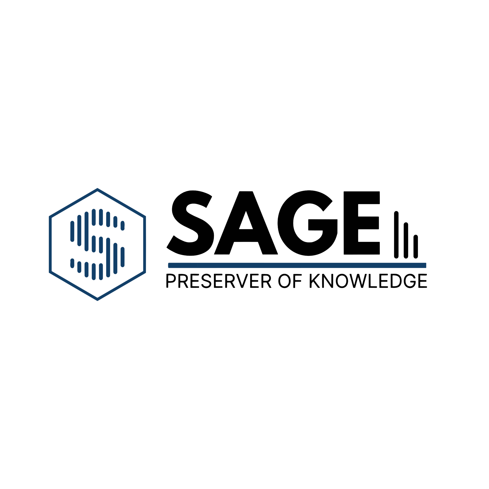
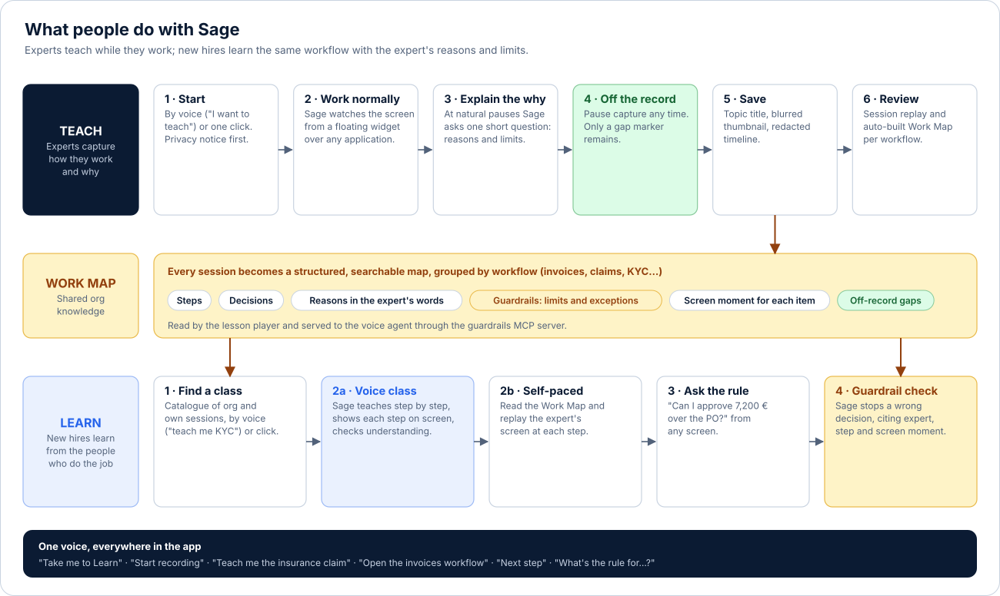
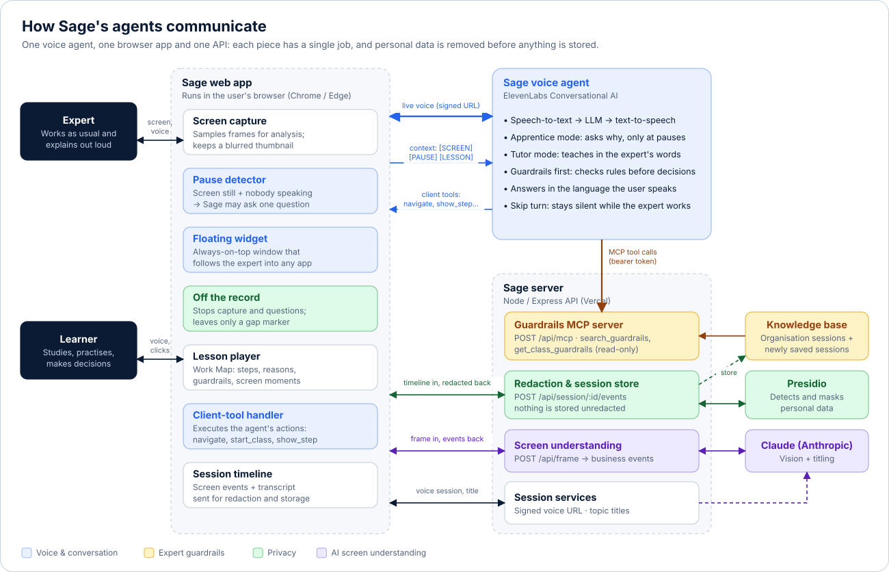
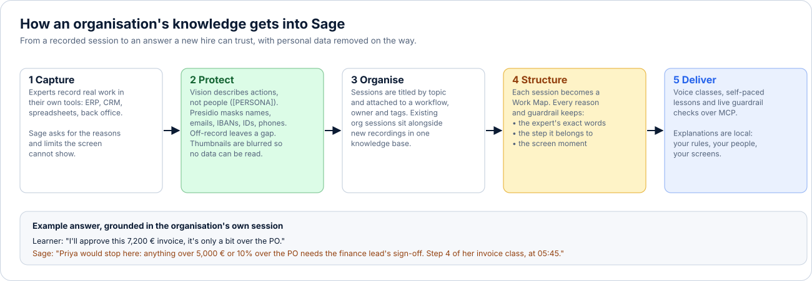

<strong>Sage preserves what your experts know and teaches it to the people who come next.</strong> 
Live demo: <a href="https://sage-zeta-ten.vercel.app">sage-zeta-ten.vercel.app</a>

---

## The problem

Every organisation depends on a few people who know how the work is *really* done: which invoice can be approved, which claim needs an adjuster, when a KYC check should go on hold. Most of that knowledge isn't written down anywhere. Procedure manuals record the steps but leave out the reasons, the limits and the exceptions, so when those people move on, retire or are simply busy, new hires learn by trial and error and the organisation absorbs the cost of their mistakes.

## What Sage does

Sage is a voice-first AI apprentice. It sits beside an expert while they do their normal work, watches the screen and, at natural pauses, asks the questions a good apprentice would ask: *Why that? At what amount would you stop and ask someone?* Each session becomes a structured **Work Map** of steps, decisions, reasons and guardrails, all in the expert's own words.

New hires then learn that workflow **from Sage, by voice or at their own pace**. When they are about to make a decision, Sage checks the experts' guardrails and steps in before they make the mistake.

| For the business | What it means in practice |
|---|---|
| **Retain tacit knowledge** | Expertise is captured during real work, with no extra documentation effort from the expert. |
| **Faster, more consistent onboarding** | Every new hire learns the same workflow, with the same reasons, from the person who does it best. |
| **Fewer costly errors** | Guardrails such as approval limits, exceptions and escalation points are enforced at the moment of decision. |
| **Trust and compliance by design** | Personal data is masked before storage, experts can go off the record, and Sage never invents a rule. |

---

## What people do with Sage

**Teach (experts).** Start a recording by voice ("I want to teach something") or with one click. Sage watches from a small floating window that stays on top of whatever application the expert is using. It stays silent while they type, read or talk, and asks one short question only when the screen is still and nobody is speaking. That is limited to five questions per ten minutes, at least 45 seconds apart. The expert can go **off the record** at any time. When they save, Sage titles the session by topic and builds the Work Map.

**Learn (new hires).** Classes are listed in a catalogue that combines the organisation's sessions with the learner's own. Each class can be taken in one of two ways:

- **Voice class:** Sage teaches one step at a time, shows each step on screen, explains the *why* in the expert's words and checks understanding before moving on.
- **Self-paced:** the learner reads the Work Map and replays the expert's screen at each step.

At any point, on any screen, the learner can describe a case ("can I approve 7,200 € over the PO?"). Sage searches the experts' guardrails first and, if a rule applies, stops them and cites the expert, the step and the moment in the recording.

---

## How the agents communicate

Sage is made of a small number of cooperating agents and services, each with one responsibility:

| Component | Role |
|---|---|
| **Sage voice agent** (ElevenLabs Conversational AI) | The single voice of the product. It listens, speaks and switches between *guide*, *apprentice* (asks why during recordings) and *tutor* (teaches classes). It drives the app through **client tools** (`navigate`, `start_recording`, `start_class`, `show_step`, `end_class`, `open_session`, `open_workflow`) and reads the experts' rules through **MCP tools**. |
| **Sage web app** (React, in the browser) | Captures the screen, detects natural pauses (screen activity plus voice activity detection) and sends the agent short context messages such as `[SCREEN]`, `[PAUSE]` and `[LESSON]`. It runs the agent's client tools and shows the lessons. |
| **Screen understanding** (Claude vision) | Turns sampled screen frames into business events ("Approves invoice 1042", "Routes the claim to a field adjuster"), describing actions rather than people. |
| **Redaction** (Microsoft Presidio) | Masks names, emails, IBANs, IDs and phone numbers in every transcript line and screen event before anything is stored. A regex filter takes over if Presidio is unavailable. |
| **Guardrails MCP server** (`POST /api/mcp`) | Read-only, token-protected [Model Context Protocol](https://modelcontextprotocol.io) server. `search_guardrails` finds the rules that apply to a situation. `get_class_guardrails` returns every rule in a class. Each result carries the expert's exact words, the step and the screen moment. |
| **Knowledge base** | The organisation's sessions plus every newly saved session, all already redacted. |

---

## Bringing your organisation's knowledge into Sage

Sage doesn't come with generic training content. It learns from **your** people working in **your** tools, so every explanation it gives is local to your organisation: your rules, your thresholds, your screens and the names of the colleagues who set them.

1. **Choose the workflows and the experts.** Start with the processes where mistakes are expensive or knowledge is concentrated in a few people (for example invoice approvals, claims triage or KYC). Workflows group sessions and show their coverage: *mapped*, *in review*, *draft* or *needs recording*.
2. **Record real work.** Experts work in their usual systems (ERP, CRM, spreadsheets, back-office tools) while Sage asks about the reasons and limits that the screen can't show. Several experts can record the same workflow, and each session keeps its owner and tags.
3. **Protect it on the way in.** Screen descriptions use placeholders such as `[PERSONA]` and `[IBAN]`, Presidio masks the transcript, off-the-record time leaves only a gap marker and thumbnails are blurred. Only redacted text reaches the knowledge base.
4. **Structure it.** Each session becomes a Work Map. Every reason and guardrail is stored with the expert's exact words, the step it belongs to and the moment on screen, so any answer can be traced back to its source.
5. **Deliver it.** The same knowledge feeds voice classes, self-paced lessons and live guardrail checks.

**What localised explanations look like:**

> **Learner:** "I'll approve this 7,200 € invoice, it's only a bit over the PO."
> **Sage:** "Priya would stop here. Anything over 5,000 € or 10% over the PO needs the finance lead's sign-off. That's step 4 of her invoice class, at 05:45."

If no expert has covered a case, Sage says so and suggests asking a lead. It does not invent a rule.

**Adding existing sessions.** The organisation's sessions are served by `GET /api/org/sessions` and searched by the MCP server alongside new recordings. In this version they are loaded from `server/src/orgSessions.ts`, where each session is a timeline of screen events and question-and-answer pairs. Adding an entry in that format makes it immediately available as a class and as a source of guardrails. Single sign-on and a per-organisation backend are the next step. Their integration points are already isolated in `web/src/lib/placeholders.ts`.

---

## A speech agent that works anywhere

Sage's voice is not tied to a single page or application:

- **Anywhere in the app.** One conversation follows the user across Home, Teach and Learn. The agent always knows which page is open and takes the user wherever they ask: "Take me to Learn", "Start recording", "Teach me the insurance claim", "Next step".
- **Over any application.** While recording, Sage lives in an always-on-top floating window (Document Picture-in-Picture in Chrome and Edge). It can observe and talk to the expert in any desktop or web tool, not just inside Sage.
- **In any language.** Sage replies in the language the user speaks, so a process recorded in English can be taught in Spanish, and vice versa.
- **In any channel.** The intelligence sits in an ElevenLabs agent plus a standard MCP server, not in the web page. The same agent and the same guardrails can be connected to other surfaces, such as a website widget, a mobile app, a phone line or another MCP-compatible assistant, without changing the knowledge layer.

---

## Privacy and trust

- A privacy notice is shown and must be accepted before the first recording.
- **Off the record** pauses capture and questions. Only a gap marker remains in the timeline and transcript.
- Every transcript line and screen event is redacted by Presidio before storage, and the UI only ever displays the redacted version.
- The vision model is instructed never to copy personal data and to use placeholders instead.
- Session thumbnails are blurred in the browser before upload.
- The MCP server is read-only and requires a bearer token in production.
- Sage only teaches what is in the Work Map. If a case isn't covered, it says so.

## Evidence: the insurance-claims experiment

[`docs/experiment-insurance-claims.md`](docs/experiment-insurance-claims.md) describes a controlled, end-to-end test with three roles (expert, new hire and observer) and invented data. It sets pass criteria for when Sage asks, what it asks, whether it has understood, whether the new hire learned (including two trap cases the expert never showed), and whether personal data stays out of storage.

---

## Technology

| Layer | Stack |
|---|---|
| Web | React, Vite, Tailwind CSS, ElevenLabs React SDK, Document Picture-in-Picture |
| Voice | ElevenLabs Conversational AI (client tools, Skip turn, custom MCP server) |
| API | Node.js, Express, Model Context Protocol SDK, Anthropic SDK (Claude) |
| Privacy | Microsoft Presidio (Python, FastAPI) |
| Hosting | Vercel (three services: `web`, `server`, `presidio`) |

## Running locally

1. **Presidio** (personal-data filter, Python 3.13): follow [presidio/README.md](presidio/README.md), then run `.venv\Scripts\python app.py` (port 5002).
2. **Server:** `cd server && cp .env.example .env`, fill in the keys, then `npm install && npm run dev` (port 3001). If Presidio isn't running, the server falls back to a basic regex filter and reports this in the console and in the UI.
3. **Web:** `cd web && npm install && npm run dev`, then open http://localhost:5173 in Chrome or Edge (needed for the floating window).
4. **Voice agent:** `node --env-file=key.env scripts/setup-agent.mjs` applies [`docs/agent-prompt.md`](docs/agent-prompt.md) to the ElevenLabs agent: prompt, client tools and, when `MCP_URL` and `MCP_TOKEN` are set, the guardrails MCP server.
5. **Guardrails MCP:** the server exposes `POST /api/mcp` (Streamable HTTP). With `MCP_TOKEN` set it requires `Authorization: Bearer <token>`. The token is mandatory on Vercel; locally, without a token, the endpoint is open.

## Project structure

| Path | Contents |
|---|---|
| `web/` | Browser app: Teach and Learn tabs, capture, pause detection (`src/lib/pauseDetector.ts`), Work Map (`src/lib/workMap.ts`) |
| `server/` | API: frame analysis, redaction, session storage, topic titles, guardrails MCP server, organisation sessions |
| `presidio/` | Personal-data detection and masking service |
| `scripts/setup-agent.mjs` | Configures the ElevenLabs agent from `docs/agent-prompt.md` |
| `docs/` | Agent prompt, experiment protocol and README diagrams (`docs/images/`) |

Sessions are stored in `server/data/<id>.json`, with `<id>.jpg` for the blurred thumbnail and `<id>.webm` for the video.
